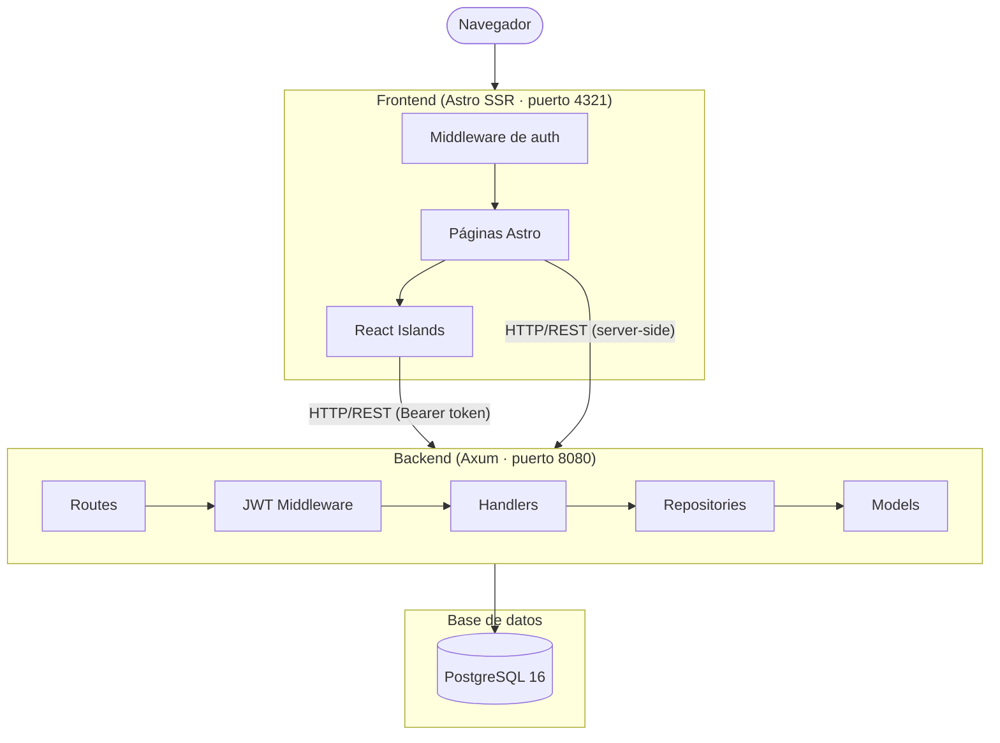
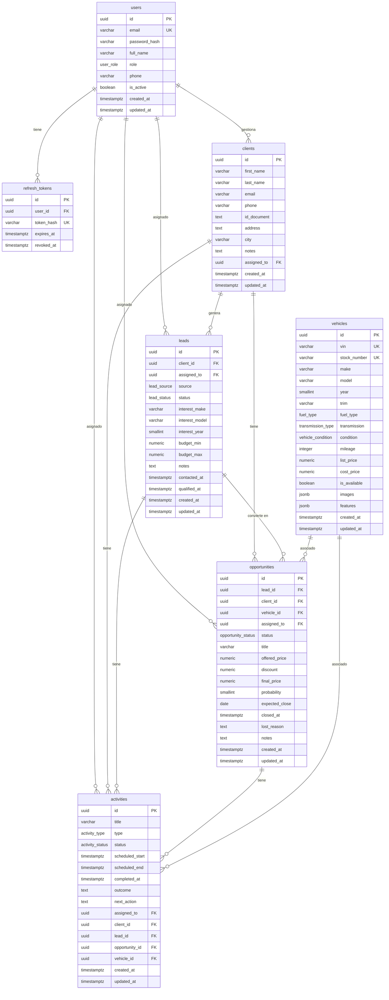
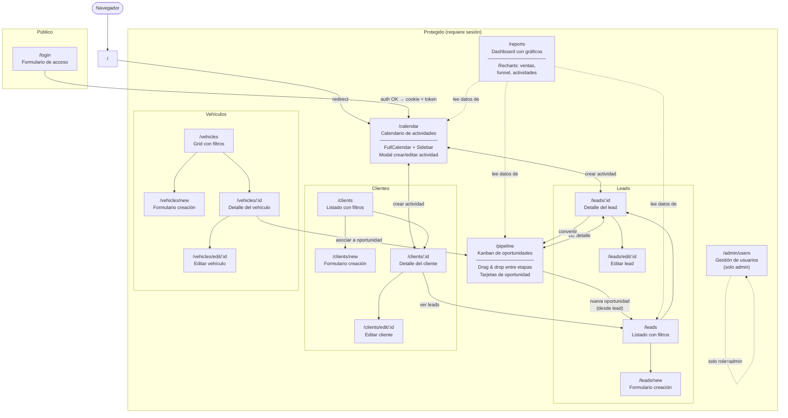
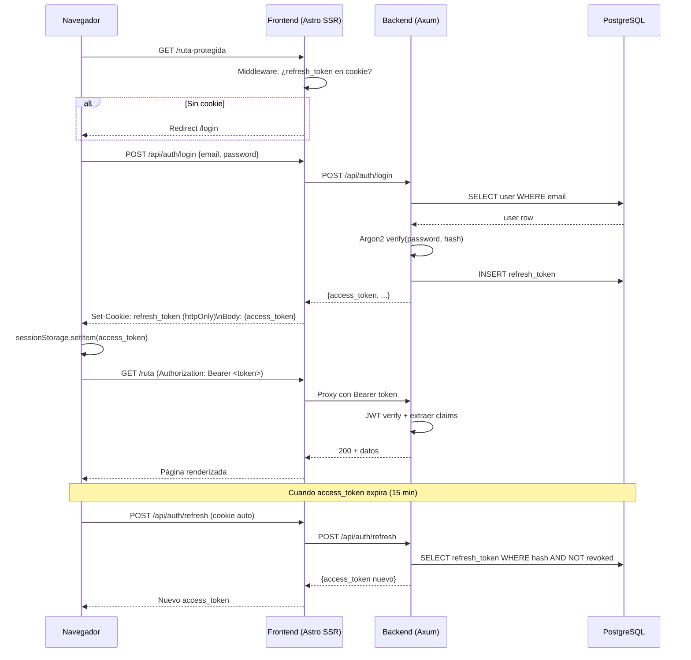
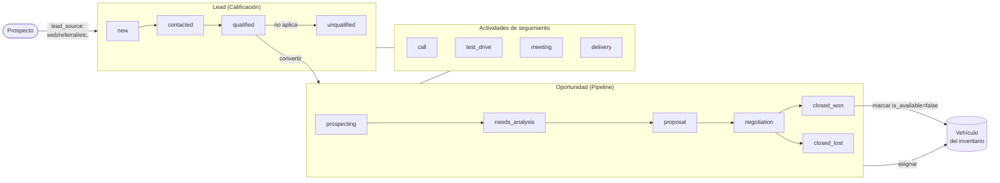
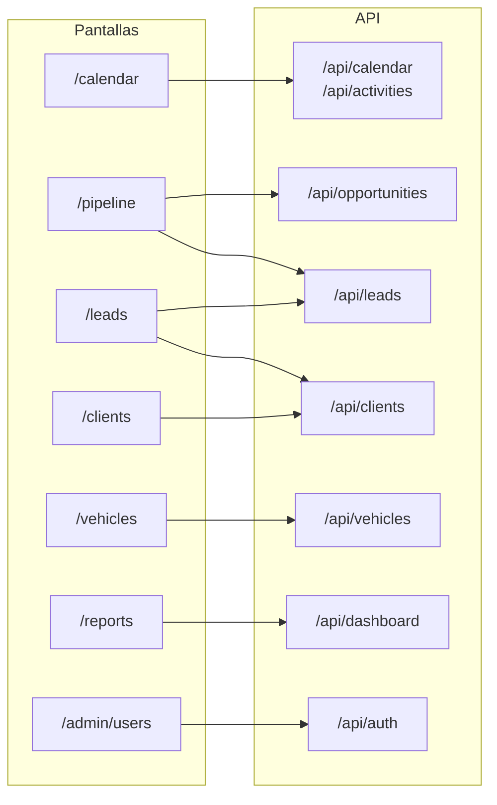

# e-Rust CRM — Sistema de Gestión para Concesionarias

CRM especializado en venta de vehículos. Gestiona clientes, inventario, pipeline de ventas, calendario de actividades y reportes.

## Stack tecnológico

| Capa | Tecnología |
|------|-----------|
| Backend | Rust + Axum 0.8 + Tokio |
| Base de datos | PostgreSQL 16 + SQLx 0.8 |
| Frontend | Astro 5 (SSR) + React 19 (islands) |
| Estilos | Tailwind CSS 3.4 |
| Auth | JWT (access 15 min) + Refresh token (cookie, 7 días) + Argon2 |
| Validación | Zod (frontend) + validator crate (backend) |
| Drag & Drop | @dnd-kit |
| Calendario | FullCalendar 6 |
| Gráficos | Recharts 2 |

---

## Arquitectura general



---

## Estructura del proyecto

```
e-Rust/
├── backend/
│   ├── migrations/          # Migraciones SQL (SQLx)
│   └── src/
│       ├── main.rs
│       ├── config.rs        # Variables de entorno
│       ├── state.rs         # Estado compartido (AppState)
│       ├── error.rs         # Manejo de errores centralizado
│       ├── db/pool.rs       # Pool de conexiones
│       ├── models/          # Structs Rust (serde)
│       ├── handlers/        # Lógica de cada endpoint
│       ├── routes/          # Configuración de rutas Axum
│       ├── repositories/    # Queries SQLx
│       ├── middleware/      # Extractor JWT
│       └── services/        # Lógica de negocio
├── frontend/
│   └── src/
│       ├── pages/           # Rutas Astro (file-based routing)
│       ├── components/      # Componentes Astro (layout, UI estática)
│       ├── islands/         # Componentes React interactivos
│       ├── lib/
│       │   ├── api/         # Clientes HTTP por módulo
│       │   └── auth/        # Store de sesión (nanostores)
│       ├── styles/
│       └── middleware.ts    # Protección de rutas
├── docker-compose.yml
├── .env.example
└── package.json             # Scripts raíz (pnpm)
```

---

## Modelo de datos



---

## Enums de la base de datos

| Enum | Valores |
|------|---------|
| `user_role` | `admin`, `manager`, `sales_agent` |
| `lead_source` | `web`, `referral`, `walk_in`, `phone`, `social_media`, `other` |
| `lead_status` | `new`, `contacted`, `qualified`, `unqualified`, `converted` |
| `opportunity_status` | `prospecting`, `needs_analysis`, `proposal`, `negotiation`, `closed_won`, `closed_lost` |
| `activity_type` | `call`, `email`, `visit`, `whatsapp`, `meeting`, `test_drive`, `delivery` |
| `activity_status` | `scheduled`, `completed`, `cancelled`, `rescheduled` |
| `fuel_type` | `gasoline`, `diesel`, `hybrid`, `electric`, `other` |
| `transmission_type` | `manual`, `automatic`, `cvt` |
| `vehicle_condition` | `new`, `used`, `certified_used` |

---

## API REST

```
POST   /api/auth/login
POST   /api/auth/logout
POST   /api/auth/refresh
POST   /api/auth/register
GET    /api/auth/me

GET    /api/clients
POST   /api/clients
GET    /api/clients/:id
PUT    /api/clients/:id
DELETE /api/clients/:id

GET    /api/vehicles
POST   /api/vehicles
GET    /api/vehicles/:id
PUT    /api/vehicles/:id
DELETE /api/vehicles/:id
PATCH  /api/vehicles/:id/availability

GET    /api/leads
POST   /api/leads
GET    /api/leads/:id
PUT    /api/leads/:id
DELETE /api/leads/:id

GET    /api/opportunities/pipeline
POST   /api/opportunities
GET    /api/opportunities/:id
PATCH  /api/opportunities/:id/status
POST   /api/opportunities/:id/close-won
POST   /api/opportunities/:id/close-lost

GET    /api/activities/upcoming
GET    /api/activities/overdue
POST   /api/activities
GET    /api/activities/:id
PUT    /api/activities/:id
DELETE /api/activities/:id
PATCH  /api/activities/:id/complete
PATCH  /api/activities/:id/reschedule

GET    /api/calendar
GET    /api/dashboard
```

---

## Pantallas y flujo de navegación



---

## Flujo de autenticación



---

## Flujo de ventas (ciclo completo)



---

## Relación entre pantallas y módulos backend



---

## Arranque rápido

```bash
# 1. Base de datos
docker compose up -d postgres

# 2. Backend (desde raíz)
pnpm dev:backend        # cargo watch — recarga en cambios

# 3. Frontend (desde raíz)
pnpm dev                # astro dev

# O ambos juntos
pnpm dev:all
```

Migraciones se aplican automáticamente al arrancar el backend (`sqlx migrate run`).

---

## Roles de usuario

| Rol | Acceso |
|-----|--------|
| `admin` | Todo + gestión de usuarios (`/admin/users`) |
| `manager` | Todo excepto gestión de usuarios |
| `sales_agent` | Solo sus propios registros asignados |
